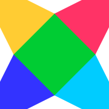

# &Iacute;ndice

1.  [Bounce juego - Haxe con Flixel](#org77fc481)
    1.  [Creación del proyecto](#org4c17aa3)
        1.  [Flixel, OpenFL, Lime](#org627cbd6)
    2.  [Testeo y construcción](#orgf8dfddc)
    3.  [Desarrollo del player](#org93121d4)
        1.  [Objetivos](#org813030a)
        2.  [Player](#org100f089)
    4.  [Desarrollo de niveles](#org8f8d609)
        1.  [Objetivos](#orgfdba3ad)
        2.  [Desarrollo](#orge7a525e)

# Bounce juego - Haxe con Flixel

Para este proyecto se usará como lenguaje de programación
el lenguaje de alto nivel &laquo;Haxe&raquo; con la librería &laquo;Flixel&raquo;

El juego es una recreación o inspiración del juego &laquo;Bounce Tales&raquo;

## Creación del proyecto

El proyecto está desarrollado en &laquo;Flixel&raquo; la cual es una librería para
el lenguaje &laquo;Haxe&raquo;, de esta forma se puede compilar para html5 (Web), Neko (para escritorio).

Primero se instala el lenguaje &laquo;Haxe&raquo; en el siguiente enlace llevará a la página oficial
de descarga [Haxe Download](https://haxe.org/download/).

### Flixel, OpenFL, Lime

Las librerías que se usarán son Flixel, OpenFL, Lime
Las cuales se instalan de la siguiente forma:

    #Instala la librería de Flixel
    haxelib install flixel
    
    #Instala la librería de Lime
    haxelib install lime
    
    #Instala la librería de OpenFL
    haxelib install openfl

Con las librerías instaladas podemos construir el proyecto.

## Testeo y construcción

Para testar el juego es necesario clonar el repositorio de GitHub o bajar el ZIP,
en una consola o terminal ejecutar:

    #Para HTML5, este se ejecuta en el navegador.
    haxelib run lime test html5
    
    #Para el escritorio, se ejecuta de forma nativa.
    haxelib run lime test neko

## Desarrollo del player

A continuación, en este apartado se explicará el desarrollo del proyecto.

### Objetivos

### Player

## Desarrollo de niveles

### Objetivos

### Desarrollo

